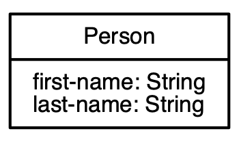

[circleci-badge]: https://circleci.com/gh/hodur-org/hodur-graphviz-schema.svg?style=shield&circle-token=37f55808bf5f74cb45eed9b4424a3da74169b540
[circleci]: https://circleci.com/gh/hodur-org/hodur-graphviz-schema
[clojars-badge]: https://img.shields.io/clojars/v/hodur/graphviz-schema.svg
[clojars]: http://clojars.org/hodur/graphviz-schema
[github-issues]: https://github.com/hodur-org/hodur-graphviz-schema/issues
[graphviz-colors]: https://www.graphviz.org/doc/info/colors.html
[graphviz]: https://www.graphviz.org/
[hodur-engine-clojars-badge]: https://img.shields.io/clojars/v/hodur/engine.svg
[hodur-engine-clojars]: http://clojars.org/hodur/engine
[hodur-engine-definition]: https://github.com/hodur-org/hodur-engine#model-definition
[hodur-engine-started]: https://github.com/hodur-org/hodur-engine#getting-started
[hodur-engine]: https://github.com/hodur-org/hodur-engine
[license-badge]: https://img.shields.io/badge/license-MIT-blue.svg
[license]: ./LICENSE
[logo]: ./docs/logo-tag-line.png
[motivation]: https://github.com/hodur-org/hodur-engine/blob/master/docs/MOTIVATION.org
[plugins]: https://github.com/hodur-org/hodur-engine#hodur-plugins
[status-badge]: https://img.shields.io/badge/project%20status-beta-brightgreen.svg

# Hodur GraphViz Schema

[![CircleCI][circleci-badge]][circleci]
[![Clojars][hodur-engine-clojars-badge]][hodur-engine-clojars]
[![Clojars][clojars-badge]][clojars]
[![License][license-badge]][license]
![Status][status-badge]

![Logo][logo]

Hodur is a descriptive domain modeling approach and related collection
of libraries for Clojure.

By using Hodur you can define your domain model as data, parse and
validate it, and then either consume your model via an API making your
apps respond to the defined model or use one of the many plugins to
help you achieve mechanical, repetitive results faster and in a purely
functional manner.

## Motivation

For a deeper insight into the motivations behind Hodur, check the
[motivation doc][motivation].

## Getting Started

Hodur has a highly modular architecture. [Hodur Engine][hodur-engine]
is always required as it provides the meta-database functions and APIs
consumed by plugins.

Therefore, refer the [Hodur Engine's Getting
Started][hodur-engine-started] first and then return here for
GraphViz-specific setup.

After having set up `hodur-engine` as described above, we also need to
add `hodur/graphviz-schema`, a plugin that creates diagrams in
GraphViz out of your model to the `deps.edn` file:

``` clojure
  {:deps {hodur/engine          {:mvn/version "0.1.6"}
          hodur/graphviz-schema {:mvn/version "0.1.0"}}}
```

You should `require` it any way you see fit:

``` clojure
  (require '[hodur-graphviz-schema.core :as hodur-graphviz])
```

Let's expand our `Person` model from the original getting started by
"tagging" the `Person` entity for GraphViz. You can read more about
the concept of tagging for plugins in the sessions below but, in
short, this is the way we, model designers, use to specify which
entities we want to be exposed to which plugins.

``` clojure
  (def meta-db (hodur/init-schema
                '[^{:graphviz/tag-recursive true}
                  Person
                  [^String first-name
                   ^String last-name]]))
```

The `hodur-graphviz-schema` plugin exposes a function called `schema`
that generates your model as a GraphViz dot payload:

``` clojure
  (def graphviz-schema (hodur-graphviz/schema meta-db))
```

When you inspect `graphviz-schema`, this is more or less what you
have:

``` dot
  digraph G {
    fontname = "Bitstream Vera Sans"
    fontsize = 8
    dpi = 300

    node [
      fontname = "Bitstream Vera Sans"
      fontsize = 8
      shape = "record"
    ]

    edge [
      fontname = "Bitstream Vera Sans"
      fontsize = 8
      arrowhead = "open"
      labelangle = 45
      labeldistance = 1.1
    ]
    
    Person [
      label="{Person|first-name: String\llast-name: String\l}";
    ]
  }
```



You can then `spit` this content on to a dot file, for isntance:

``` clojure
  (spit "diagram.dot" graphviz-schema)
```

And then run dot directly with:

``` bash
  $ dot -Tpng -odiagram.png diagram.dot
```

  This will give you a diagram like this:



## Model Definition

All Hodur plugins follow the [Model
Definition][hodur-engine-definition] as described on Hodur [Engine's
documentation][hodur-engine].

## Choosing Entities' Colors

You can select the color of a specific entity by using the marker
`:graphviz/color`:

``` clojure
  [^{:graphviz/tag-recursive true
  :graphviz/color "navajowhite1"}
   Person
   [^String name]

   ^{:graphviz/tag-recursive true
   :graphviz/color "lightsalmon"}
   Business
   [^String total-revenue]]
```

GraphViz colors can be [found here][graphviz-colors].

## Selectively Generating and Grouping

You can always choose whether an entity and any of it's fields or
parameters get generated by either tagging it for GraphViz with
`:graphviz/tag` or not. However, sometimes you need finer control to
create more bespoke diagrams.

One such situations is called grouping. You can mark an entity as part
of a certain group with the marker `:graphviz/group`:

``` clojure
  [^{:graphviz/tag-recursive true
  :graphviz/group "people-stuff"}
   Person
   [^String name]

   ^{:graphviz/tag-recursive true
   :graphviz/color "business-stuff"}
   Business
   [^String total-revenue]]
```

The `schema` function takes a map as its second argument where you can
specify which groups you want to generate. In the following example
you would generate just the `Person` entity above as it is the only
one marked as part of the `"people-stuff"` group:

``` clojure
  (hodur-graphviz/schema meta-db {:groups ["people-stuff"]})
```

Another situation is when you want to generate just what has been
tagged for some other plugin. For instance, you want a diagram of all
the entities that are going to be used by your SQL schema plugin. In
that situation you can use the same map but specifying a collection of
tags:

``` clojure
  (hodur-graphviz/schema meta-db {:tags [:sql]})
```

Of course, both systems can be combined.

## Extra options

You may want to configure what DPI will be used when generating an
image from dot file. Per default 300 dpi will be used, but you can set
it:

```clojure
  (hodur-graphviz/schema meta-db {:dpi 600})
```

This will mark dot file to generate 600 dpi image files.

## Bugs

If you find a bug, submit a [GitHub issue][github-issues].

## Help!

This project is looking for team members who can help this project
succeed! If you are interested in becoming a team member please open
an issue.

## License

Copyright © 2019 Tiago Luchini

Distributed under the MIT License (see [LICENSE][license]).
